<p align="center">
  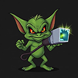
</p>

<h1 align="center">Network Goblin Scout</h1>

<p align="center"><b>A pocket goblin that eats radio waves and gets stronger.</b><br>
<i>Firmware for the NM-CYD-C5 · ESP32-C5 · dual-band Wi-Fi 6 · BLE 5 · 802.15.4</i></p>

<p align="center">
  <a href="https://scout.networkgoblin.dev/flash/"><b>⚡ Flash it in your browser</b></a> ·
  <a href="https://scout.networkgoblin.dev/leaderboard/"><b>🏆 Leaderboard</b></a> ·
  <a href="https://scout.networkgoblin.dev/"><b>🌐 scout.networkgoblin.dev</b></a> ·
  <a href="https://networkgoblin.dev/">🧌 Network Goblin Labs</a>
</p>

<p align="center">
  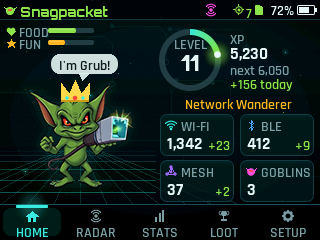
  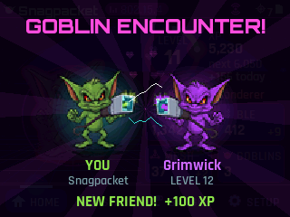
</p>

---

## What is this?

You know Tamagotchis? You know Wi-Fi scanners? Somebody (a goblin) put them in a blender.

NG Scout is a little handheld pet that lives on a 2.8" touchscreen and **feeds on the airwaves**.
Carry it around and it quietly listens for Wi-Fi networks, Bluetooth gadgets and smart-home mesh
chatter. Every new thing it hears goes into the **hoard**. The hoard gives XP. XP makes the goblin
level up. Levelling up makes the goblin insufferable.

It never connects to anything (except your own Wi-Fi, when *you* press Sync), never sends probes, and
never stores the actual names or addresses of what it hears. It just *sniffs*. Respectfully. Like a goblin
with manners.

**Want one?** Grab an [NM-CYD-C5](https://github.com/RockBase-iot/NM-CYD-C5), plug it into a computer and
press **Install** on the [web flasher](https://scout.networkgoblin.dev/flash/). Two minutes, no tools.

## The goblin's powers

| | |
|---|---|
| 📡 **Dual-band Wi-Fi sniffing** | 2.4 *and* 5 GHz, passive beacon listening. Spots Wi-Fi 6, WPS, hidden networks, and the occasional WEP fossil. |
| 🔵 **Bluetooth snooping** | Passive BLE scans. iBeacons, Eddystone, named gadgets. Phones with rotating addresses count as *sightings*, not trophies (no farming!). |
| 🕸️ **Mesh eavesdropping** | The C5's third radio listens to 802.15.4: Zigbee bulbs, Thread sensors, Matter hubs. Your smart home is chattier than you think. |
| 💎 **Loot rarity** | Every new network or gadget is loot. The goblin works out what it found from the maker code: *another Netgear? Common.* An office access point left wide open? **Legendary.** A Starlink dish, a Tesla, AirPods, a Garmin, an Oura ring, a card terminal... 193 brands in 22 kinds, five rarities from Common (1 XP) to Legendary (50 XP), and a **Hoard Book** to fill in. Phones that keep changing their Bluetooth address only count the first time a brand turns up, so there's no farming. |
| 🐬 **Hacker gear** | The goblin notices the hacker toys: a **Flipper Zero** (a wild dolphin appears!), a **Pwnagotchi**, a **Wi-Fi Pineapple**, an **ESP deauther** and **Bluetooth popup spam** storms. Each one gets its own scene, XP, a trophy, and the **Black Hat**. Strictly listening: whoever owns the gear never knows. |
| 👺 **Goblin encounters** | Two Scouts near each other *notice each other* (Pwnagotchi-style). Cue the encounter scene, sparks, hearts and **+100 XP** for a new friend. |
| 👃 **Sniff-offs** | Then they sniff each other's hoards. Bigger hoard wins (level breaks a tie) and *both* goblins get XP. Bragging rights not included, but strongly implied. |
| 🏷️ **Tracker alert** | Actually useful: if an AirTag, Tile, SmartTag or Google tracker keeps tagging along with you through 3+ places for 15+ minutes, the goblin sounds the alarm. Your own? Tap **It's mine** and it never nags about that one again. |
| 🏆 **142 achievements** | Bronze, silver, gold and shimmering-rainbow legendary. Some are secret. One involves petting the goblin a frankly concerning number of times. |
| ✨ **A goblin with feelings** | It bobs, blinks, hops when it finds something, glows when it levels up, and snores in pocket mode. It also talks (and babbles, if you wire up a speaker). Mostly about packets. |
| 🍖 **Needs** | It gets **hungry** (feed it new devices) and **bored** (show it new channels, places, networks and goblins). Keep both meters full and it earns **+25% XP**. Neglect it and it sulks. |
| 📜 **Quests** | A board of three challenges at a time: *"Sniff out 20 new networks"*, *"Find a Wi-Fi 6 router"*... Clear the board for bonus XP, then a fresh one turns up. |
| 🎩 **Hats** | 18 hats, from party hat to wizard hat to tinfoil hat, unlocked by milestones, plus seasonal ones (Witch Hat in October, Santa Hat in December...). Your hat travels in the goblin beacon, so other goblins see it when you meet. Fashion matters. |
| 📡 **Radar** | A live sweep of everything heard in the last minute. Distance = signal strength, colour = radio, other goblins show up as little goblin heads. |
| 🪪 **Share card** | Hold the goblin (or Setup → Share card) for a trading card with its name, level, hat, stats and a **QR code** (to your goblin's leaderboard page once you've synced). Made for photos. |
| 🌙 **Day & night** | Dawn glow, dusk glow, a starry night sky, and a goblin that naps from 11 pm (it keeps sniffing in its sleep). Needs the time: GPS, or set the clock in Setup. |
| 🔋 **Battery-aware** *(optional)* | Add a LiPo and a fuel gauge (MAX17048, or the BQ27441 on a SparkFun Battery Babysitter; see [docs/battery.md](docs/battery.md)) for battery % and a charging bolt in the status bar, and a sleepy goblin when it runs low. |
| 🗺️ **Exploration** *(GPS optional)* | Plug in a GPS for daily streaks and "areas explored". Coordinates never leave the SD card. |
| 📈 **Leaderboards** | Press **Sync** (Setup → Sync & leaderboard) and your goblin uploads a summary of its hoard over your Wi-Fi to [the leaderboard](https://scout.networkgoblin.dev/leaderboard/): XP, this week, Wi-Fi, Bluetooth, mesh, goblins met, trophies and sniff-offs, plus a profile page per goblin. Counts only, no account needed, and **remove me** takes you off again. |
| 📴 **Offline first** | No account, no cloud, no app needed. Syncing is optional and only happens when you press the button. The SD card is optional too (but without it the goblin forgets everything at bedtime). |

## Screenshots

<table>
<tr>
<td>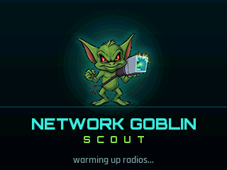<br><sub>Boot. The goblin awakens.</sub></td>
<td>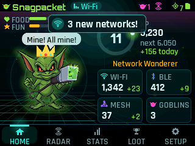<br><sub>"Mine! All mine!"</sub></td>
<td>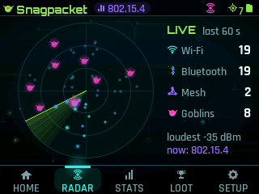<br><sub>Radar: everything nearby, live.</sub></td>
</tr>
<tr>
<td>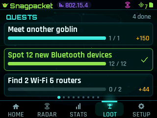<br><sub>Quest board.</sub></td>
<td>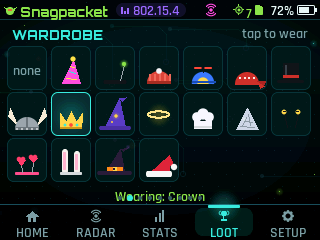<br><sub>The wardrobe. Crown sold separately (level 20).</sub></td>
<td>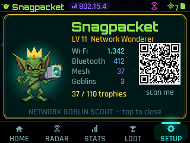<br><sub>Share card, QR included.</sub></td>
</tr>
<tr>
<td>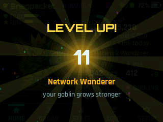<br><sub>Level up. Unbearable now.</sub></td>
<td>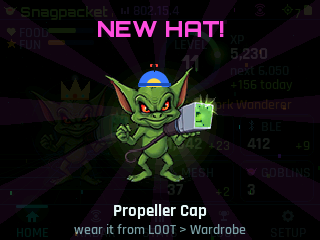<br><sub>New hat unlocked.</sub></td>
<td>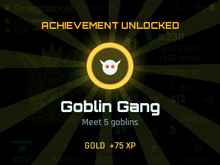<br><sub>Achievement unlocked.</sub></td>
</tr>
<tr>
<td>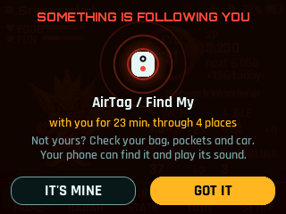<br><sub>Something's following you. The goblin noticed.</sub></td>
<td>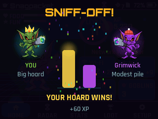<br><sub>Sniff-off! Biggest hoard wins.</sub></td>
<td>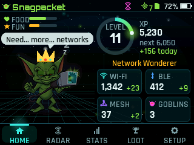<br><sub>Night shift. Stars out, goblin napping.</sub></td>
</tr>
<tr>
<td>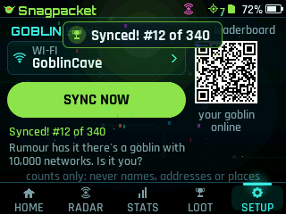<br><sub>Goblin Sync: onto the leaderboard.</sub></td>
<td>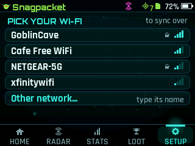<br><sub>Pick your Wi-Fi (once).</sub></td>
<td>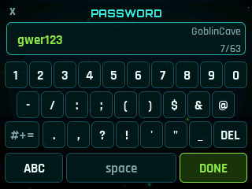<br><sub>A real keyboard, symbols and all.</sub></td>
</tr>
<tr>
<td>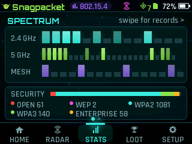<br><sub>Every channel it's ever heard.</sub></td>
<td>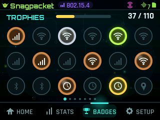<br><sub>The trophy shelf.</sub></td>
<td>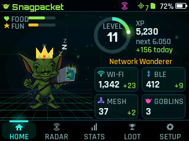<br><sub>Pocket mode. zzz.</sub></td>
</tr>
</table>

<sub>These are rendered on a PC from the real UI code (`sh tools/preview/run.sh`), so they're exactly what the
firmware draws, minus the smudges on your screen.</sub>

## Summoning a goblin

### The easy way: web flasher (recommended)

1. Open **[scout.networkgoblin.dev/flash](https://scout.networkgoblin.dev/flash/)** in **Chrome or Edge** on a computer.
2. Plug the board in with a USB-C *data* cable.
3. Press **Install Scout** (new board) or **Update Scout** (already running Scout), pick the board's port, wait a minute.
4. Copy [`sd_card/`](sd_card/) onto a FAT32 microSD card and slot it in. The goblin needs somewhere to keep its hoard.
5. Press RESET. Accept the disclaimer and **name your goblin** on the on-screen keyboard. Scanning starts after that.

The flasher always serves the latest tested release and writes every file at the right address.

### By hand (no web flasher)

1. Download the files from the [web flasher page](https://scout.networkgoblin.dev/flash/) (links under
   *Prefer the command line?*), or from this repo's **Actions** tab → latest green **build** → **Artifacts**
   (`ng-scout-<commit>`, every commit, untested).
2. Flash `firmware.factory.bin` at `0x0`:
   - **Browser:** <https://espressif.github.io/esptool-js/> (Chrome/Edge), add the file at `0x0`, Program.
   - **Command line:** `pip install esptool`, then
     `esptool --chip esp32c5 --port <COM5 or /dev/ttyACM0> write-flash 0x0 firmware.factory.bin`
3. If it won't connect: hold **BOOT**, tap **RESET**, let go of BOOT, try again.
4. SD card and first boot: as steps 4-5 above.

### Updating without losing your goblin

Your progress lives on the **SD card** (`/scout/`), so re-flashing doesn't touch it.
- **Updates:** the web flasher's **Update Scout**, or `firmware.bin` at `0x10000` by hand (app only, keeps the chip's settings too).
- **First install or recovery:** flash `firmware.factory.bin` at `0x0`. This also wipes the chip's
  internal settings, but the goblin's name and ID are restored from the SD card at the next boot.

> ⚠️ **Check the address before you press flash.** Many tools (including Espressif's web tool) default to
> `0x0`. `firmware.bin` written at `0x0` overwrites the bootloader, and the board boot-loops with
> `invalid header: 0x5d455b5d` on the serial log. Not bricked: flash `firmware.factory.bin` at `0x0` (or use
> the web flasher's **Install**) and it's back, progress included.

### The proper way (PlatformIO)

```sh
pip install platformio==6.2.0
pio run                # build
pio run -t upload      # flash
pio device monitor     # watch the goblin think out loud (115200 baud)
```

The first build downloads the **pioarduino** platform (Arduino core 3.3.x, the only one that speaks
ESP32-C5). It's big. Make a sandwich.

## Living with your goblin

- **Tabs** along the bottom: Home, Radar, Stats, Loot, Setup. **Swipe** left/right to flip tabs and pages.
- **Tap the goblin** to pet it. It likes that. Probably. **Hold** it to pull up its share card.
- **Loot** = quests, then the wardrobe (tap a hat to wear it), then the trophy shelf. Tap a badge to read
  what it's for. Secret ones stay secret until you earn them.
- **Food & fun meters** (top left of Home): a fed, entertained goblin earns +25% XP. Take it somewhere new.
- **BOOT button** = pocket mode: screen off, goblin keeps sniffing. Tap the screen to wake it.
- **Setup → Turbo display** runs the screen at full speed. If you see glitches, turn it off.
- **Setup → Goblin beacon** controls whether other goblins can find *yours* (see privacy below).
- **Setup → Sync & leaderboard**: pick your Wi-Fi once, then **Sync now** whenever you want your goblin's
  numbers on the [leaderboard](https://scout.networkgoblin.dev/leaderboard/). The QR code on that screen opens
  your goblin's page. **remove me** (tap twice) takes your goblin off the boards; Sync puts it back.
- **Back up `/scout/sync.key`** somewhere safe: it's your goblin's leaderboard identity. If the SD card dies,
  copy it onto the new card and your goblin keeps its place.
- **Setup → Clock** sets the time (no GPS needed; it's forgotten at power-off). With GPS it sets your time zone instead.
- **Setup → About** to rename your goblin.

### Hardware bring-up mode

Something weird with a new board? Power on and **press BOOT within 1.5 s** while the splash says
"press BOOT now for diagnostics". (Holding BOOT *while* plugging in puts the C5 into flashing mode
instead. Ask us how we know.)

You get one screen, mirrored to serial every 2 s: PSRAM, SD card test, raw touch values, Wi-Fi / BLE /
802.15.4 scan counts, goblins seen, GPS, an I2C scan, LED colours and display colour swatches.
Press RESET to leave.

## Privacy: the goblin's code of conduct

The goblin is nosy, not creepy.

- **Listening is passive.** Wi-Fi listens for beacons (no probe requests), BLE never sends scan requests
  or connects, and 802.15.4 only listens.
- **Nothing raw is stored.** MAC addresses, SSIDs and mesh addresses are kept only as **salted SHA-256 ids**
  (the salt is random per device). You can count your hoard but you can't read it back.
- **GPS stays home.** Coordinates are written to the SD card and nowhere else: not the screen, not serial.
- **Loot without logging.** To rate a find, the goblin looks at the router's maker code (the first half of its
  address) and, for random addresses, a few name patterns ("DIRECT-", "iPhone"...), or at the company id in a
  Bluetooth advert, in memory at that moment. Only the brand ("Netgear") and the counts are kept. The maker
  lists come from the IEEE registry and the Bluetooth SIG.
- **No farming.** BLE devices with rotating private addresses (most phones) are *sightings*, not unique devices.
- **Tracker alert stays local.** Trackers are followed by salted id, in memory, to spot one that keeps
  following *you*. Nothing is sent anywhere. Works best with AirTags and other Find My tags, Tile and Google
  tags; trackers that change address often can slip through, so treat silence as "not seen", not "safe".
- **Sync only when you say so.** Goblin Sync joins *your* Wi-Fi only when you press Sync, uploads counts
  (level, XP, how many networks/devices, trophies, hats), then disconnects. Never names, addresses, ids or
  locations. Your Wi-Fi password stays on the device. Uploads are signed with a key that never leaves it
  (except once, over HTTPS, to register), so nobody else can post as your goblin.
- **Goblins met, honestly.** Sync also sends the random beacon ids of goblins you've met, so the server can
  count a meeting only when *both* goblins report it. The site only ever shows how many, never who met whom.
- **Leave any time.** Sync screen → **remove me** (tap twice) deletes your goblin's entry from the server.
  Pressing Sync later puts it back.
- **The one thing it sends on its own** is the goblin beacon: a non-connectable BLE advert with a random goblin id, a
  generated goblin name, its level and colour. It uses a random address made fresh at every boot (never the
  chip's real Bluetooth MAC). It also carries your hat and a rough hoard size for sniff-offs. Switch it off in Setup and you can still see other goblins.

## The hoard (what's on the SD card)

```
/scout/salt.bin      random per-device salt (don't share)
/scout/state.json    XP, counters, channels, achievements, settings
/scout/wifi.csv      id, ssid_id, channel, auth, rssi, unix_time, lat, lon   (one line per new BSSID)
/scout/ssids.txt     ids of unique SSIDs
/scout/ble.csv       id, rssi, unix_time                                     (one line per new stable BLE device)
/scout/154.csv       id, pan_id, channel, zigbee|thread|?, rssi, unix_time   (one line per new mesh device)
/scout/pans.txt      ids of mesh networks (PAN id + channel)
/scout/peers.txt     ids of goblins met, their level when you met
/scout/cells.txt     ids of ~5 km exploration cells visited
/scout/trackers.txt  ids of item trackers heard, and what kind
/scout/trackers_ok.txt  trackers you said are yours (no alerts for these)
/scout/sync.key      your goblin's leaderboard key (like salt.bin: don't share it)
/scout/met.txt       beacon ids of goblins met (for the leaderboard's encounter cross-check)
/sprites/<pack>/     sprite packs (see below)
```

## Make your own goblin (sprite packs)

Don't like the default goblin? Rude, but fine. Drop a pack in `/sprites/<name>/` and pick it in
Setup → Sprite pack. Example: the included `pixel_goblin`.

```json
{
  "name": "Pixel Goblin", "author": "you", "version": "1.0",
  "states": {
    "idle": ["idle_01.bmp", "idle_02.bmp"],
    "scanning": ["scan_01.bmp", "scan_02.bmp"],
    "happy": ["happy_01.bmp"],
    "excited": [], "level_up": [], "achievement": [], "searching": [],
    "sleep": [], "low_battery": [], "offline": [], "uploading": [], "sync_complete": []
  }
}
```

- BMP: 24-bit, 32-bit (alpha) or 16-bit RGB565, uncompressed, max 128×128.
- 64×64 or smaller gets drawn at 2× (pixel-art friendly). Magenta `#FF00FF` is transparent.
- Missing states fall back to `idle`; a broken pack falls back to the built-in goblin.
- Aliases: `discovered` ← `happy`, `level_up` ← `levelup`, `sleep` ← `sleeping`.

## Goblin anatomy (code layout)

```
include/board.h          pin map from the NM-CYD-C5 v1.0 schematic
include/config.h         tunables: display, touch calibration, scan timing, XP rules
src/main.cpp             wiring + main loop
src/hal/                 display, touch, SD, GPS, LED/speaker, battery gauge
src/scanners/            one Scanner per radio: Wi-Fi, BLE, 802.15.4 (+ ScanManager)
src/social/              the goblin's identity, its "I'm a goblin" beacon, sniff-offs and Goblin Sync
src/core/                Engine (sighting → XP → achievements → SD), achievements list
src/ui/                  screens, the animated goblin, widgets; gfx/ = tiny renderer
src/diag/                hardware bring-up mode
test/                    PC unit tests (802.15.4 parser, beacon, quests, tracker alert, clock)
tools/preview/           renders the real UI on a PC into PNGs (CI also runs it under AddressSanitizer)
tools/bench/             counts instructions per frame on the ESP32-C5's CPU type (emulated)
tools/gen_assets.py      turns assets/ (logo, fonts) into C++ headers
sd_card/                 copy to the microSD card
```

- **New radio?** Implement `Scanner` (begin / start / poll) and `scans.add()` it. The engine doesn't care
  where a sighting came from.
- **New achievement?** Append a line to `ACHIEVEMENTS[]` in `src/core/Achievements.cpp`. Never reorder or
  rename ids; they're saved on SD.
- **New hat?** Append to `kHats[]` in `src/core/Hats.cpp` and draw it in `src/ui/HatArt.cpp`.
  **New quest type?** Append to `quests::Type` and `kDefs[]` in `src/core/Quests.cpp`.
- **Share card link?** Set `NG_SHARE_URL` in `include/config.h`.
- **New screen tweak?** Run `sh tools/preview/run.sh` and look at `tools/preview/out/` before flashing.

## Quest log

- [x] Display, touch, SD, GPS (auto-detect), RGB LED, speaker
- [x] Dual-band Wi-Fi + BLE sniffing, persistent dedupe
- [x] 802.15.4 (Zigbee / Thread) sniffing
- [x] Goblin encounters (needs two goblins, or a phone faking one; see `CLAUDE.md`)
- [x] 142 achievements, levels, streaks, exploration
- [x] Hunger & boredom, quest boards, 17 hats (4 seasonal), radar, share card with QR code
- [x] Animated goblin and a UI that doesn't look like 1997
- [x] First-run disclaimer, name your goblin, progress survives re-flashing
- [x] Tracker alert, sniff-offs, day/night, seasonal hats
- [x] Battery support in firmware (MAX17048 or BQ27441). The hardware side is DIY: [docs/battery.md](docs/battery.md)
- [x] Goblin Sync, [leaderboards](https://scout.networkgoblin.dev/leaderboard/) and goblin profiles, self-service removal
- [x] [Web flasher](https://scout.networkgoblin.dev/flash/): install and update from the browser
- [x] Encounter cross-checks: the "goblins met" board counts only meetings both goblins report
- [x] Loot rarity: 193 brands (Wi-Fi and Bluetooth), five rarities, a Hoard Book, and a Legendary finds board
- [x] Hacker gear sightings: Flipper Zero, Pwnagotchi, Wi-Fi Pineapple, deauthers, Bluetooth popup spam
- [ ] ~~Temperature stat~~ the on-board AHT20 turned out to be imaginary (not fitted)

## Credits

- Goblin art: Network Goblin.
- Fonts: [Orbitron](https://fonts.google.com/specimen/Orbitron) and
  [Rajdhani](https://fonts.google.com/specimen/Rajdhani), SIL Open Font License (see `assets/fonts/`).
- Board: [RockBase NM-CYD-C5](https://github.com/RockBase-iot/NM-CYD-C5).
- Display library: [Arduino_GFX](https://github.com/moononournation/Arduino_GFX).
- Maker codes: the [IEEE OUI registry](https://standards-oui.ieee.org/) and the Bluetooth SIG company list
  (via the `bluetooth-numbers` package), turned into a table by `tools/gen_oui.py`.
  Thanks to [SquachWatch](https://github.com/skizzophrenic/SquachWatch-CYD) for the nudge to look at what
  the radios are saying (and for its careful notes on which maker codes can be trusted).
- QR codes: [Nayuki's QR Code generator](https://www.nayuki.io/page/qr-code-generator-library) (MIT), in `lib/qrcodegen/`.

<p align="center"><i>Feed the goblin. Respect the airwaves.</i></p>
