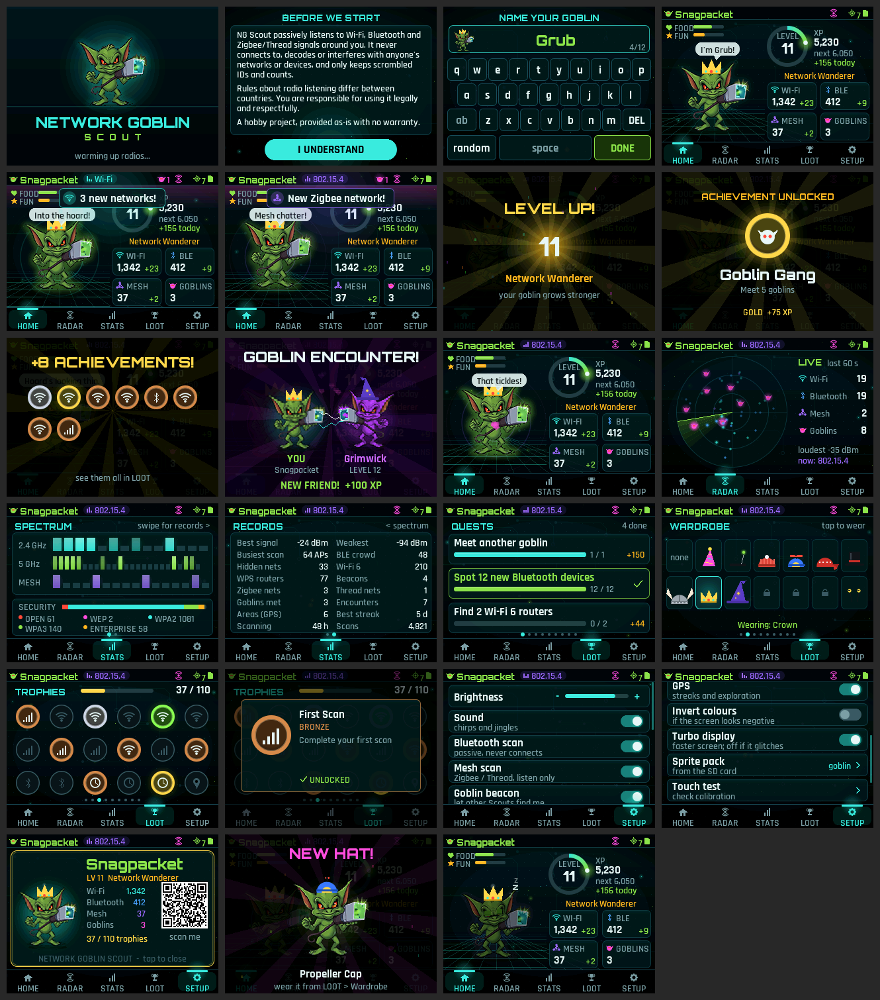

# Network Goblin Scout — firmware

Passive wireless discovery companion for the **NM-CYD-C5** (ESP32-C5, dual-band Wi-Fi 6, BLE 5, 802.15.4).
Scan → discover → earn XP → unlock achievements → level up your goblin. Works fully offline.



- **Three radios, all listen-only:** dual-band Wi-Fi (2.4 + 5 GHz), Bluetooth LE, and 802.15.4
  (Zigbee / Thread / Matter-over-Thread smart-home meshes).
- **Goblin encounters:** two Scouts near each other notice each other (like a Pwnagotchi), play an
  encounter scene, become friends and earn XP. See *Privacy notes* for what this transmits.
- **110 achievements** in bronze / silver / gold / legendary, a few of them secret.
- **Animated goblin** (the Network Goblin logo) that bobs, blinks, hops, glows and reacts to discoveries.

## Build & flash

1. VS Code + PlatformIO. Open this folder.
2. First build downloads the **pioarduino** platform (Arduino core 3.3.x, needed for ESP32-C5). It's large; give it a few minutes.
3. Plug in either USB-C port. `PlatformIO: Upload`, then `Monitor`.
   Logs go to the **native ESP32-C5 USB port** by default. To get logs on the CH340 port, set
   `ARDUINO_USB_MODE` and `ARDUINO_USB_CDC_ON_BOOT` to `0` in `platformio.ini`.
4. Copy the contents of `sd_card/` to the root of a FAT32 microSD card.

No toolchain? Every push builds in GitHub Actions: open the run under **Actions**, download the
`ng-scout-<commit>` artifact and flash `firmware.factory.bin` at `0x0` (see `FLASHING.txt` inside).

### Hardware bring-up mode

Power on, then **press BOOT within 1.5 s** while the splash says "press BOOT now for diagnostics".
(Holding BOOT *while* powering on can put the ESP32-C5 into USB flashing mode instead.)
One screen, mirrored to serial every 2 s, shows PSRAM, SD, raw touch, Wi-Fi / BLE / 802.15.4 scan
counts (plus other goblins seen), GPS, the AHT20 sensor (not fitted on every board), an I2C scan, LED
colours and display colour swatches. Press RESET to exit.

### Using it

- **Tabs** along the bottom: Home, Stats, Badges, Setup. **Swipe** left/right to change tab or page.
- **Tap the goblin** to pet it. Tap a badge for its details. Drag the Setup list to scroll.
- The **BOOT** button toggles "pocket mode" (screen off, scanning continues). Tap the screen to wake.
- Serial prints `ui: N fps, render X ms, screen push Y ms` every 10 s (handy for tuning).

## First-boot checklist

| Check | If it's wrong |
|---|---|
| Screen shows the splash, then the goblin | Colors inverted: Settings → Invert colors. Mirrored/rotated: change `DISPLAY_ROTATION` in `include/config.h` |
| Tapping the tabs works | Settings → Touch test, tap the four corners, then adjust `TOUCH_*` in `config.h` (swap/invert/min/max) |
| Status bar shows green **SD** | Card must be FAT32; progress won't save without it |
| Wi-Fi count climbs, 5 GHz channels light up on the Stats strip | Tell Claude what the serial log shows |
| BLE count climbs | BLE only counts devices with **stable** addresses (see privacy notes) |
| Mesh count climbs | Only if there are Zigbee/Thread devices nearby (smart bulbs, sensors, Matter hubs) |

## Layout

```
include/board.h          Pin map from the NM-CYD-C5 v1.0 schematic
include/config.h         Tunables: display, touch calibration, scan timing, XP rules
src/main.cpp             Wiring + main loop (non-blocking)
src/hal/                 Display (PSRAM canvas), Touch (XPT2046), Storage (SD), Gps, Fx (LED/speaker), Aht20
src/scanners/            Scanner interface + WifiScanner, BleScanner, ThreadScanner (802.15.4), ScanManager
src/social/              Goblin identity + "I'm a goblin" BLE beacon (PeerCodec = wire format)
src/core/                Engine (discovery → XP → achievements → persistence), Achievements, SeenStore, HashSet64
src/ui/                  Ui (screens, overlays, input), Companion (animated goblin), Widgets, Theme, Sprites (SD packs)
src/ui/gfx/              Small software renderer (alpha blending, anti-aliased text) — pure C++
src/ui/assets/           Generated goblin art + fonts (tools/gen_assets.py from assets/)
src/diag/                Hardware bring-up mode
test/                    PC unit tests (802.15.4 parser, beacon codec)
tools/preview/           Renders the real UI on a PC into PNGs: `sh tools/preview/run.sh`
sd_card/                 Copy to microSD root — includes the example `pixel_goblin` sprite pack
```

**Adding a radio** = implement `Scanner` (begin/start/poll) and `scans.add()` it. The engine doesn't care where a `Sighting` came from.

**Adding an achievement** = append a line to `ACHIEVEMENTS[]` in `core/Achievements.cpp`. Never reorder or rename ids (they're saved on SD and will be synced later).

## What's on the SD card

```
/scout/salt.bin      Random per-device salt (don't share)
/scout/state.json    XP, counters, channels, achievements, settings
/scout/wifi.csv      id, ssid_id, channel, auth, rssi, unix_time, lat, lon   (one line per new BSSID)
/scout/ssids.txt     ids of unique SSIDs
/scout/ble.csv       id, rssi, unix_time                                     (one line per new stable BLE device)
/scout/154.csv       id, pan_id, channel, zigbee|thread|?, rssi, unix_time (one line per new 802.15.4 device)
/scout/pans.txt      ids of 802.15.4 networks (PAN id + channel)
/scout/peers.txt     ids of other goblins met, level when first met
/scout/cells.txt     ids of ~5 km exploration cells visited
/sprites/<pack>/     metadata.json + BMP frames
```

### Privacy notes

- Scanning is **passive**: Wi-Fi listens for beacons (no probe requests), BLE never sends scan requests or
  connects, and 802.15.4 only listens.
- The one thing NG Scout **transmits** is its goblin beacon: a non-connectable BLE advert with a random goblin
  id, a generated goblin name, level and colour. It uses a random address made at each boot (never the chip's
  real Bluetooth MAC). Turn it off in Setup → Goblin beacon; you can still see other goblins.
- MAC addresses, SSIDs and 802.15.4 addresses/PAN ids are stored only as **salted SHA-256 ids**, never in plain
  text. GPS coordinates stay on the card.
- BLE devices using rotating private addresses (most phones) count as *sightings*, not unique devices.

## Sprite packs

`/sprites/<name>/metadata.json`:

```json
{
  "name": "Pixel Goblin", "author": "you", "version": "1.0",
  "states": {
    "idle": ["idle_01.bmp", "idle_02.bmp"],
    "scanning": ["scan_01.bmp", "scan_02.bmp"],
    "happy": ["happy_01.bmp"],
    "excited": [], "level_up": [], "achievement": [], "searching": [],
    "sleep": [], "low_battery": [], "offline": [], "uploading": [], "sync_complete": []
  }
}
```

- BMP, 24-bit, 32-bit (alpha) or 16-bit RGB565, uncompressed. Max 128×128.
- Sprites 64×64 or smaller are drawn at 2× (pixel-art friendly).
- Magenta `#FF00FF` is transparent.
- Missing states fall back to `idle`; a missing or broken pack falls back to the built-in (logo) goblin.
- Setup → Sprite pack cycles through packs on the card.
- `discovered` also accepts `happy`; `level_up` also accepts `levelup`; `sleep` also accepts `sleeping`.

## Status / next steps

- [x] Display, touch, SD, GPS (auto-detect), RGB LED, speaker
- [x] Passive dual-band Wi-Fi + BLE scanning, persistent dedupe
- [x] Passive 802.15.4 (Zigbee/Thread) scanner — compiles; awaiting hardware test
- [x] Goblin encounters (BLE beacon) — compiles; needs two boards to test
- [x] XP, levels, 110 achievements, daily streak (needs GPS time), exploration cells
- [x] Animated logo goblin, new GUI, SD sprite packs
- [ ] Battery: board has no charger/sense. Plan: LiPo → charger/boost → 5V on P5 pin 1; I2C fuel gauge (e.g. MAX17048) on CN1 since all ADC pins are used
- [ ] ~~AHT20 environment stat~~ skipped: the AHT20 isn't fitted on the owner's board
- [ ] Account pairing + summary sync + website — later phase
